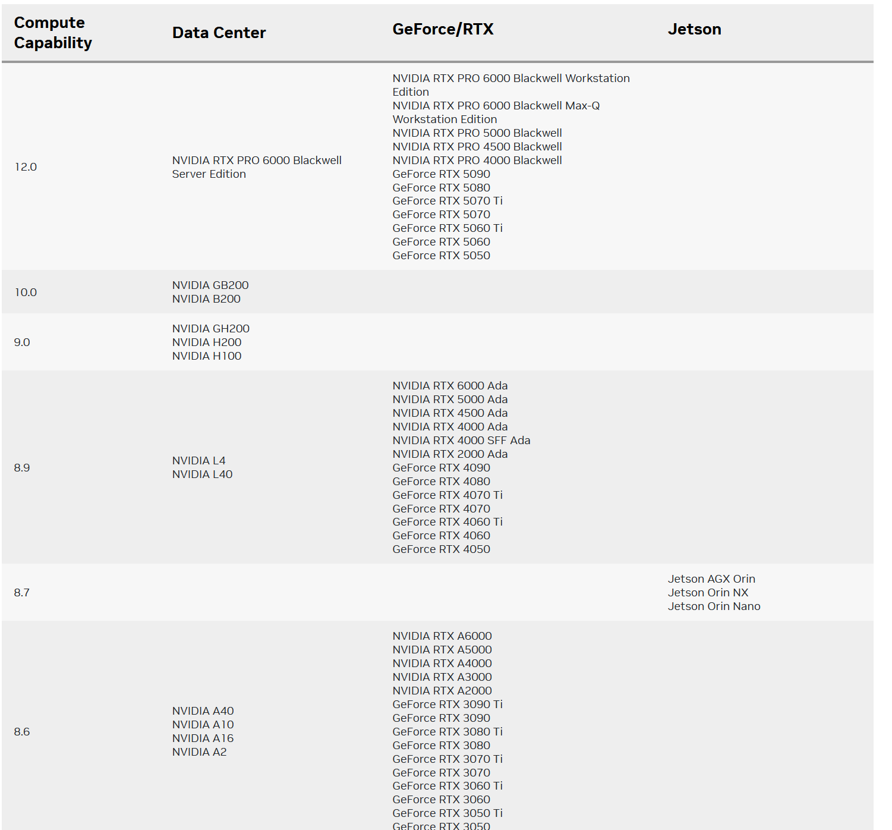
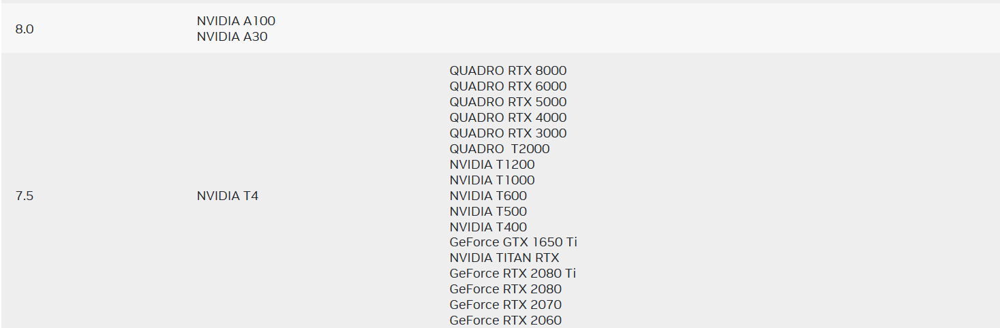
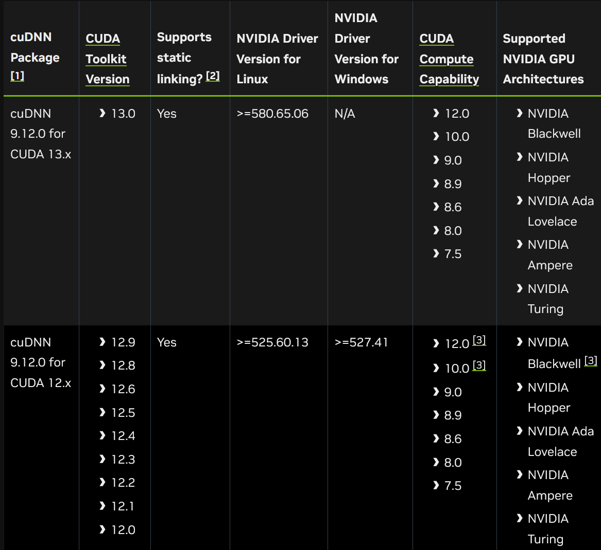
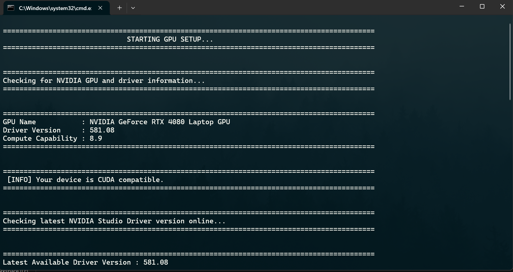

# cuSuite - Install fast. Build faster.


## _NOTE_ : This repository is _**NOT**_ affiliated with or sponsored by NVIDIA. _cuSuite_ is an independent, community project and is _**NOT**_ an official NVIDIA product


This repository provides an automated **Batch Script Installer** for CUDA and cuDNN on Windows.  
The script handles the following:

- Detects **GPU model and driver version**.  
- Installs the **latest compatible CUDA Toolkit**.  
- Sets up **cuDNN support** for deep learning frameworks.  
- Configures **environment variables** for seamless usage.  
- Verifies installation with `nvcc --version` and `nvidia-smi`.


## Components of Original Packages

### 1. CUDA Toolkit
- Core development kit for GPU-accelerated computing.
- Provides:
  - **nvcc** compiler
  - **CUDA Runtime**
  - **Driver API**
  - **cuBLAS** (Basic Linear Algebra Subroutines)
  - **cuFFT** (Fast Fourier Transform library)
  - **cuRAND** (Random number generation)
  - **cuSPARSE** (Sparse matrix operations)
  - **cuSOLVER** (Dense and sparse direct solvers)

### 2. cuDNN (CUDA Deep Neural Network Library)
- GPU-accelerated library for deep learning primitives.
- Supports:
  - **Convolutions**
  - **Pooling**
  - **Normalization**
  - **Recurrent Neural Networks (RNNs)**
  - **Tensor Cores (FP16/INT8 acceleration)**


##  System Requirements

- **OS:** Windows 10 / 11 (64-bit)  
- **GPU:** NVIDIA GeForce, RTX, Quadro, or Tesla with CUDA Compute Capability ≥ 7.5
- **Drivers:** Latest Game Ready / Studio Drivers  
- **Languages Supported:** English (US by default, configurable)


## Compute Capability Chart

Refer to NVIDIA’s official compute capability chart:  


Each GPU family has a *Compute Capability* value (e.g., RTX 4090 = 8.9).  
This determines the maximum CUDA Toolkit & cuDNN versions supported.

---

## CUDA/cuDNN Support Matrix

The compatibility matrix for CUDA and cuDNN:  


- CUDA Toolkit versions map to supported cuDNN versions.  
- Ensure **cuDNN is matched with your installed CUDA version**.  

---

## Installation (Automated)

1. Clone this repository:
   ```bash
   git clone https://github.com/<your-repo>/cuda-installer.git
   cd cuda-installer
   ```

2. Run the installer:
   ```bash
   .\NVIDIA_MakeDL_Tools.bat
   ```

## Manual Verification

After installation, verify the setup:

1. Check CUDA installation:
   ```bash
   nvcc --version
   ```

2. Check GPU status:
   ```bash
   nvidia-smi
   ```
## Images of cuSuite
